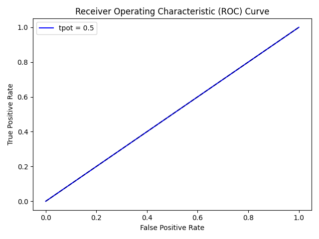
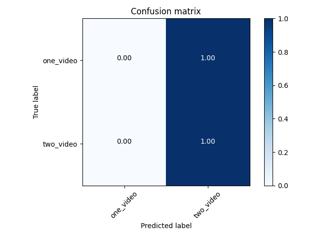

# TEST model 
This is a test model created on 2020-08-02 12:53:10.549166 classifying ['one_video', 'two_video']. It was trained using the tpot script, and achieves the following accuracy scores: 
```
{'accuracy': 0.75, 'balanced_accuracy': 0.5, 'precision': 0.75, 'recall': 1.0, 'f1_score': 0.8571428571428571, 'f1_micro': 0.75, 'f1_macro': 0.42857142857142855, 'roc_auc': 0.5, 'roc_auc_micro': 0.5, 'roc_auc_macro': 0.5, 'confusion_matrix': [[0, 1], [0, 3]], 'classification_report': '              precision    recall  f1-score   support\n\n   one_video       0.00      0.00      0.00         1\n   two_video       0.75      1.00      0.86         3\n\n    accuracy                           0.75         4\n   macro avg       0.38      0.50      0.43         4\nweighted avg       0.56      0.75      0.64         4\n'}
```



## Settings 
```
{'version': '1.0.0', 'augment_data': False, 'balance_data': True, 'clean_data': False, 'create_csv': True, 'default_audio_augmenters': ['augment_volume'], 'default_audio_cleaners': ['clean_mono16hz'], 'default_audio_features': ['librosa_features'], 'default_audio_transcriber': ['deepspeech_dict'], 'default_csv_augmenters': ['augment_ctgan_regression'], 'default_csv_cleaners': ['clean_csv'], 'default_csv_features': ['csv_features'], 'default_csv_transcriber': ['raw text'], 'default_dimensionality_reducer': ['pca'], 'default_feature_selector': ['kbest'], 'default_image_augmenters': ['augment_imaug'], 'default_image_cleaners': ['clean_greyscale'], 'default_image_features': ['image_features'], 'default_image_transcriber': ['tesseract'], 'default_outlier_detector': ['isolationforest'], 'default_scaler': ['standard_scaler'], 'default_text_augmenters': ['augment_textacy'], 'default_text_cleaners': ['remove_duplicates'], 'default_text_features': ['nltk_features'], 'default_text_transcriber': ['raw text'], 'default_training_script': ['tpot'], 'default_video_augmenters': ['augment_vidaug'], 'default_video_cleaners': ['remove_duplicates'], 'default_video_features': ['video_features'], 'default_video_transcriber': ['tesseract (averaged over frames)'], 'dimension_number': 100, 'feature_number': 20, 'model_compress': False, 'reduce_dimensions': False, 'remove_outliers': True, 'scale_features': False, 'select_features': False, 'test_size': 0.1, 'transcribe_audio': True, 'transcribe_csv': True, 'transcribe_image': True, 'transcribe_text': True, 'transcribe_video': True, 'visualize_data': False, 'transcribe_videos': True}
```

